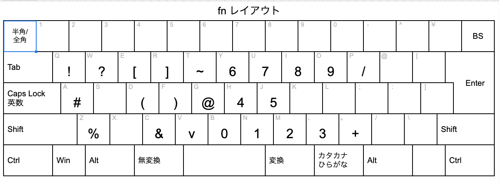

# karabiner-setting

fn レイヤーを追加するための設定
|from|to|
|--|--|
|semicolon|enter|
|fn+q|!|
|fn+w|?|
|fn+e|[|
|fn+r|]|
|fn+t|~|
|fn+a|#|
|fn+d|(|
|fn+f|)|
|fn+g|@|
|fn+z|%|

# layout

- 編集リンク
  https://docs.google.com/spreadsheets/d/1kvUnBsT9xYhC6uF-TBkQtoiQE2BkHMRonxbUNStPlo4/edit#gid=208843704

# memo

- keychron 用に設定したのでデフォルトで fn ショートカットが設定されるキーは設定できなかった
  - S
  - X
  - L
  - J
  - K
